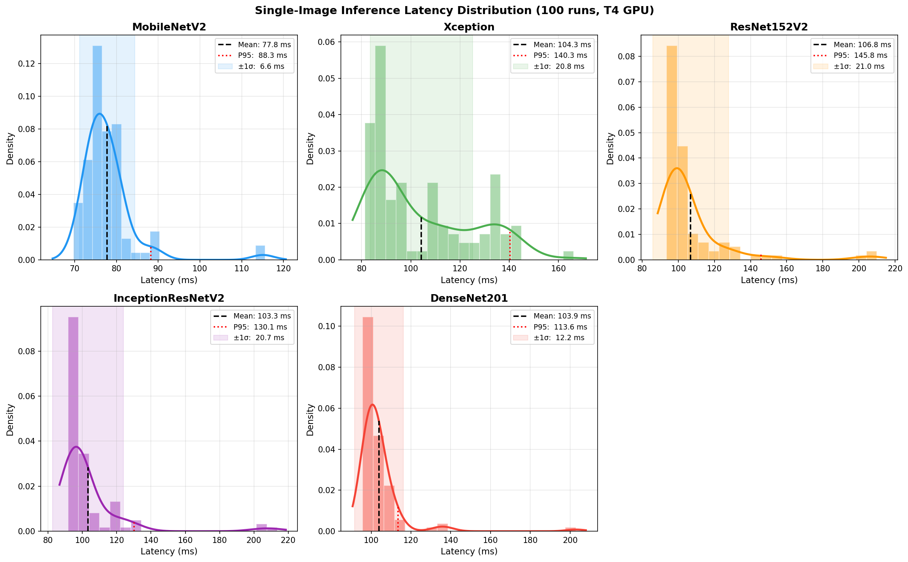
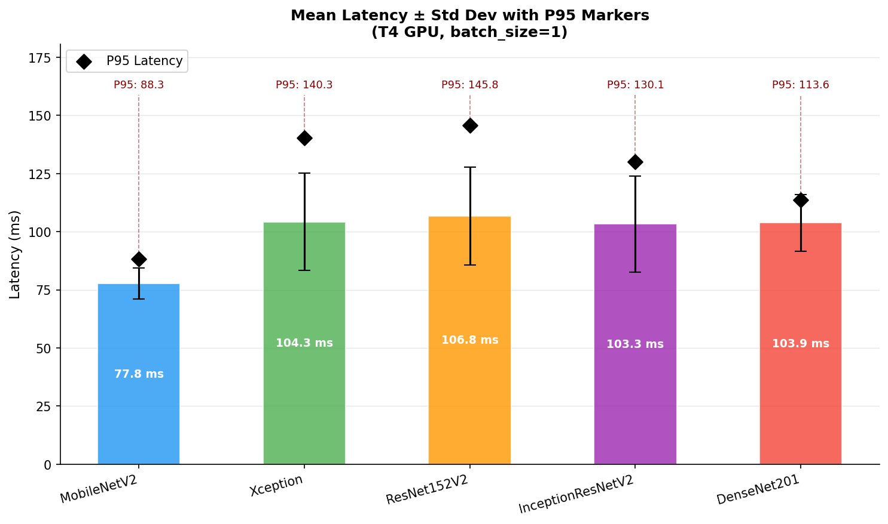

# 🔬 Cataract Detection Using Transfer Learning


<br/>

> **A comparative study of five state-of-the-art deep learning architectures for automated cataract detection using transfer learning — with rigorous single-image inference latency benchmarking on Google Colab T4 GPU.**

---

## 📌 Project Overview

Cataracts are the leading cause of blindness worldwide. Early automated detection can significantly improve patient outcomes. This project builds and evaluates five fine-tuned CNN models to classify eye images into:

| Class | Description |
|---|---|
| 🔴 Cataract | Eye affected by cataract |
| 🟢 Normal | Healthy eye |
| ⚪ Not Eye | Non-eye image (filtered out) |

---

## 🧠 Models Evaluated

| Architecture | Model Size | Input Size |
|---|---|---|
| MobileNetV2 | 19.07 MB | 224×224 |
| Xception | 86.99 MB | 224×224 |
| ResNet152V2 | 231.14 MB | 224×224 |
| InceptionResNetV2 | 214.79 MB | 224×224 |
| DenseNet201 | 74.31 MB | 224×224 |

---

## 📦 Downloads

| Resource | Link |
|---|---|
| 📂 Dataset (Train/Test Images) | [Google Drive — Dataset](https://drive.google.com/drive/folders/1WL2YAN5i1ZwMDb8UZiK7R0osNU_0yHlz?usp=sharing) |
| 🏋️ Trained Model Weights (.h5 / .keras) | [Google Drive — Model Weights](https://drive.google.com/drive/folders/1HpAwOwoIPpltkMqSlmukdjiwzo6rRKro?usp=sharing) |

> Model weights are too large for GitHub (19MB–231MB). Download them from Google Drive and place them in your `/content/drive/MyDrive/Cataract/` folder before running the notebooks.

---

## 📊 Results

### Accuracy & Loss Comparison

| Architecture | Train Acc | Test Acc | Train Loss | Test Loss |
|---|---|---|---|---|
| **MobileNetV2** | 0.9974 | **0.9969** | **0.0067** | **0.0101** |
| Xception | 0.9975 | 0.9933 | 0.0087 | 0.0183 |
| ResNet152V2 | 0.9983 | 0.9941 | 0.0739 | 0.0153 |
| InceptionResNetV2 | 0.9917 | 0.9808 | 0.0217 | 0.0570 |
| DenseNet201 | 0.9985 | 0.8774 | 0.0032 | 0.3022 |

### Recall & F2 Score

| Architecture | Recall | F2 Score |
|---|---|---|
| MobileNetV2 | 0.9945 | 0.9945 |
| Xception | 0.9949 | 0.9949 |
| ResNet152V2 | **0.9953** | **0.9953** |
| InceptionResNetV2 | 0.9851 | 0.9850 |

### ⚡ Latency Benchmark — Single-Image Inference (100 Runs, T4 GPU)

| Architecture | Mean (ms) | Std (ms) | P95 (ms) | CV% |
|---|---|---|---|---|
| **MobileNetV2** | **77.8** | **6.6** | **88.3** | **8.5** |
| Xception | 104.3 | 20.8 | 140.3 | 19.9 |
| ResNet152V2 | 106.8 | 21.0 | 145.8 | 19.7 |
| InceptionResNetV2 | 103.3 | 20.7 | 130.1 | 20.0 |
| DenseNet201 | 103.9 | 12.2 | 113.6 | 11.7 |

> **CV%** = σ/μ × 100 — lower means more consistent latency under real conditions

---

## 📈 Latency Distribution Plots

### Individual Distribution — Histogram + KDE + Mean/P95 Markers


### Mean Latency ± Std Dev with P95 Markers


---

## 🔬 Methodology

### Dataset Split
| Split | Images |
|---|---|
| Train | 8,896 |
| Validation | 2,221 |
| Test | 2,552 |

### Training Strategy
- ImageNet pretrained weights loaded for all base models
- Custom CNN classification head added on top
- Base layers frozen; only custom head trained
- Adam optimizer (lr = 0.0001), categorical crossentropy loss
- 20 epochs with ModelCheckpoint saving best val_accuracy
- Data augmentation: horizontal flip, vertical flip, rescaling

### Latency Benchmarking (Research-Grade)
```python
# Single image — no I/O overhead in timing loop
single_image_input = next(iter(test_it))[0][:1]  # batch_size=1

# 10 warm-up runs to stabilize GPU memory
for _ in range(10):
    best_model.predict(single_image_input, verbose=0)

# 100 timed runs using high-resolution monotonic timer
N = 100
times = []
for _ in range(N):
    start = time.perf_counter()
    best_model.predict(single_image_input, verbose=0)
    end = time.perf_counter()
    times.append((end - start) * 1000)  # ms
```

---

## 🏆 Key Finding

**MobileNetV2 is the best architecture for cataract detection deployment:**

| Metric | MobileNetV2 | Next Best |
|---|---|---|
| Test Accuracy | **99.69%** | ResNet152V2: 99.41% |
| Avg Latency | **77.8 ms** | InceptionResNetV2: 103.3 ms |
| P95 Latency | **88.3 ms** | DenseNet201: 113.6 ms |
| Consistency (CV%) | **8.5%** | DenseNet201: 11.7% |
| Model Size | **19.07 MB** | DenseNet201: 74.31 MB |

MobileNetV2's depthwise separable convolutions make it lightweight and highly consistent — ideal for edge and clinical deployment.

---

## 🗂️ Repository Structure

```
cataract-detection-transfer-learning/
├── notebooks/
│   ├── MobileNetV2_FineTune.ipynb
│   ├── DenseNet201.ipynb
│   ├── ResNet152V2.ipynb
│   ├── Xception_FineTune.ipynb
│   └── InceptionResNetV2.ipynb
├── results/
│   ├── plot1_individual.png
│   └── plot3_barchart.png
├── latency_data/
│   ├── latency_MobileNetV2.npy
│   ├── latency_DenseNet201.npy
│   ├── latency_ResNet152V2.npy
│   ├── latency_Xception.npy
│   └── latency_InceptionResNetV2.npy
├── LICENSE
└── README.md
```

---

## ⚙️ How to Run

1. Download the dataset from the [Google Drive link](https://drive.google.com/drive/folders/1WL2YAN5i1ZwMDb8UZiK7R0osNU_0yHlz?usp=sharing) and place it in `/content/drive/MyDrive/Cataract/Data/`
2. Download model weights from the [Google Drive link](https://drive.google.com/drive/folders/1HpAwOwoIPpltkMqSlmukdjiwzo6rRKro?usp=sharing) and place them in `/content/drive/MyDrive/Cataract/`
3. Open any `.ipynb` notebook in Google Colab
4. Mount Google Drive and set correct paths
5. Run cells 0–5 (mount, imports, paths, datagen, iterators)
6. **Skip** training cells — models already saved as `.h5`
7. Run load_model → compile → evaluate → latency cells

---

## 🛠️ Tech Stack

- **Python** 3.12 · **TensorFlow** 2.20 / Keras
- **NumPy** · **Matplotlib** · **SciPy** · **Scikit-learn**
- **Google Colab** T4 GPU

---

## 📄 License

MIT License — see [LICENSE](LICENSE) for details.

---

## 👤 Author


- Suyog Khanal  - [countylover7@gmail.com](mailto:countylover7@gmail.com)
Hasnain Haider — [hhnain1006@gmail.com](mailto:hhnain1006@gmail.com)
---

<div align="center"><sub>Built with ❤️ for medical AI research</sub></div>
